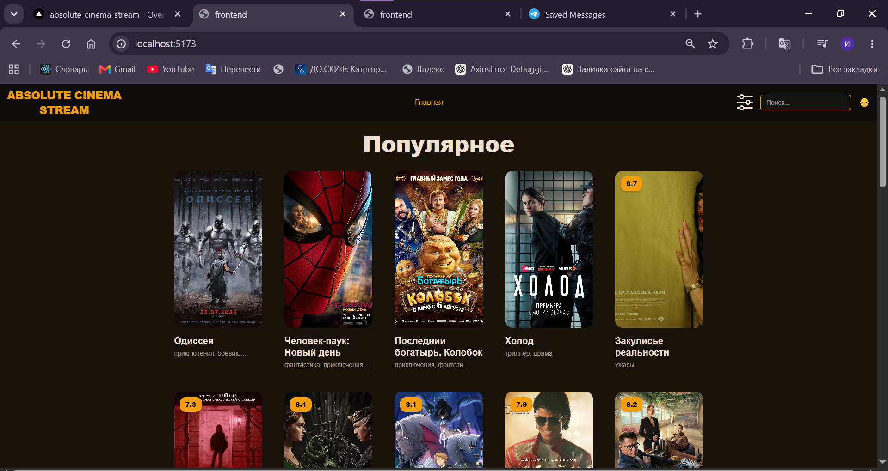
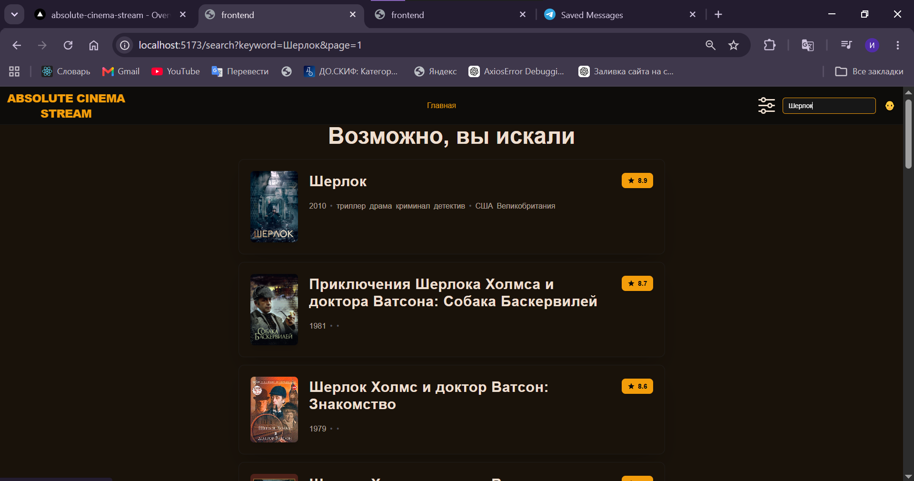
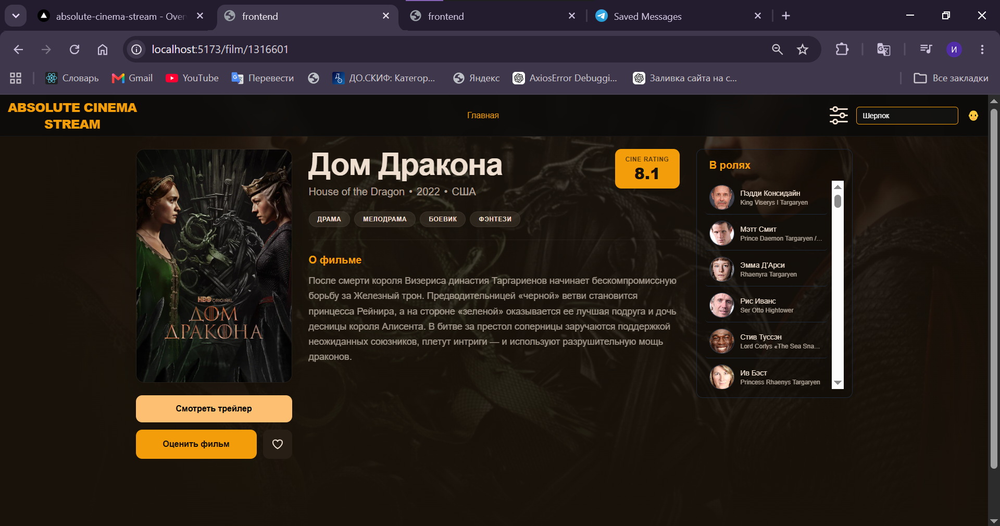
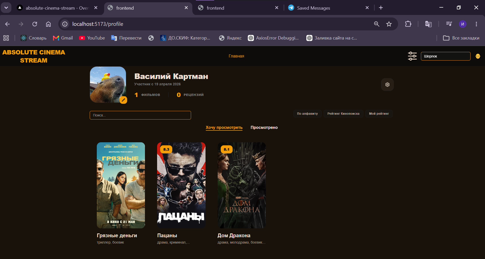

# AbsoluteCinemaStream

AbsoluteCinemaStream — фронтенд/проект для просмотра фильмов. В репозитории есть фронтенд на React + Vite + TypeScript с TailwindCSS, управление состоянием через Redux Toolkit.

Технологии

- React 19 + TypeScript
- Vite
- TailwindCSS
- Redux Toolkit
- react-router-dom
- axios

Запуск (фронтенд)

1. Перейти в папку фронтенда:
   ```bash
   cd frontend
   ```
2. Установить зависимости:
   ```bash
   npm install
   ```
3. Создайте файл .env в корне папки frontend и укажите ваш API-ключ:
   ```
   VITE_API_KINOPOISK_URL=[https://kinopoiskapiunofficial.tech/](https://kinopoiskapiunofficial.tech/)
   VITE_API_KINOPOISK_KEY=ваш_api_ключ
      ```  
4. Запустить режим разработки:
   ```bash
   npm run dev
   ```

Структура страниц

- Главная (Home): подборки, новинки, рекомендованные фильмы — точка входа для пользователя.

- Поиск (Search): поиск по названию/фильтрам, постраничный вывод результатов).

- Страница фильма (Film Detail): подробности фильма, трейлер, рейтинг, рекомендации и кнопки «Добавить в избранное»/«Смотреть».

- Профиль (Profile): управление избранным, история просмотров.


Функционал (возможности сайта)

- Поиск по названию и навигация по результатам с параметром ?page в URL.
- Пагинация и флаги загрузки по страницам (SearchPageLoading).
- Просмотр карточки фильма с краткой информацией (FilmCardHorizontal) и переходом на детальную страницу.
- Воспроизведение видео через react-player, поддержка превью/плейлистов.
- Управление состоянием через Redux Toolkit; асинхронные запросы через axios.
- Чистая маршрутизация через react-router-dom (управление query-параметрами через setSearchParams).
- TailwindCSS для стилизации и адаптивного интерфейса.

[GitHub Репозиторий](https://github.com/truk808/AbsoluteCinemaStream)  
> [!WARNING]
> (Обратите внимание: Проект использует бесплатный тариф Kinopoisk API с лимитом 500 запросов в день. Если контент на странице не загружается, вероятнее всего, суточный лимит API на сегодня исчерпан.)  
[LiveDemo](https://absolute-cinema-stream-nu.vercel.app/)  


